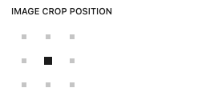

# Editor Controls

A collection of custom WordPress Gutenberg editor controls for building block editor templates. These reusable components provide enhanced functionality for managing content, selecting media, working with dates and times, and more.

## Table of Contents

### Fields
- [DatePicker](#datepicker)
- [DateTimePicker](#datetimepicker)
- [GoogleMapControl](#googlemapcontrol)
- [IconSelector](#iconselector)
- [ImageAlignMatrix](#imagealignmatrix)
- [ImageSelect](#imageselect)
- [LabeledSpinner](#labeledspinner)
- [LinkSelect](#linkselect)
- [MetaRepeater](#metarepeater)
- [OverlayOpacitySlider](#overlayopacityslider)
- [PostCheckboxes](#postcheckboxes)
- [PostPicker](#postpicker)
- [Repeater](#repeater)
- [TagSelect](#tagselect)
- [TermCheckboxes](#termcheckboxes)
- [TimePicker](#timepicker)
- [TMCEControl](#tmcecontrol)
- [TruncateControl](#truncatecontrol)
- [VideoSelect](#videoselect)
- [Toolbar Dropdowns](#toolbar-dropdowns)
### Template Components
- [CtaControl](#ctacontrol)
- [ImageSelectButton](#imageselectbutton)
- [LinkList](#linklist)
- [PlaceholderIframe](#placeholderiframe)
- [PlaceholderImage](#placeholderimage)
- [PlaceholderVideo](#placeholdervideo)
- [RepeaterControls](#repeatercontrols)
- [RepeaterPopover](#repeaterpopover)

---

## CtaControl


A WordPress Gutenberg editor control component for creating call-to-action buttons or styled links. For use in block editor templates, it displays a placeholder for the button or link, and when clicked, opens a popover for editing button text and link settings.

[View Documentation →](./CtaControl/README.md)

---

## DatePicker


A WordPress Gutenberg editor control component for selecting dates. For use in block editor templates, it displays a button with a calendar icon and formatted date, and when clicked, opens a dropdown with a date picker interface.

[View Documentation →](./DatePicker/README.md)

---

## DateTimePicker


A WordPress Gutenberg editor control component for selecting both dates and times. For use in block editor templates, it displays a button with a calendar icon and formatted date/time, and when clicked, opens a dropdown with a date picker interface and time selection controls.

[View Documentation →](./DateTimePicker/README.md)

---

## GoogleMapControl


A WordPress Gutenberg editor control component for selecting locations using Google Maps. For use in block editor templates, it displays an interactive Google Map with an autocomplete search input, allowing users to search for addresses and select locations with precise coordinates.

[View Documentation →](./GoogleMapControl/README.md)

---

## IconSelector


A WordPress Gutenberg editor control component for selecting icons from a predefined list. For use in block editor sidebars, it displays a dropdown with icon options that show both the icon name and a visual preview of the icon.

[View Documentation →](./IconSelector/README.md)

---

## ImageAlignMatrix



A WordPress Gutenberg editor control component for selecting image alignment using a matrix-style interface. For use in block editor sidebars, it provides a visual grid where users can click to select alignment positions for images.

[View Documentation →](./ImageAlignMatrix/README.md)

---

## ImageSelect


A WordPress Gutenberg editor control component for use in the block sidebar. It is inspired by the WP Featured Image selector.

[View Documentation →](./ImageSelect/README.md)

---

## ImageSelectButton


A WordPress Gutenberg editor control component that provides a button interface for selecting images from the WordPress media library. Built on top of the WordPress `MediaUpload` component with specialized functionality for single image selection and gallery management.

[View Documentation →](./ImageSelectButton/README.md)

---

## LabeledSpinner


A simple WordPress Gutenberg editor control component that displays a loading spinner with a label. Useful for showing loading states in block editor controls.

[View Documentation →](./LabeledSpinner/README.md)

---

## LinkList


A WordPress Gutenberg editor control component for managing a list of links. Provides an interface for adding, editing, and removing multiple links with title and URL settings, commonly used for navigation menus or resource lists in blocks.

[View Documentation →](./LinkList/README.md)

---

## LinkSelect


A WordPress Gutenberg editor control component for managing links with URL and target settings. This control wraps the WordPress LinkControl component in a BaseControl for consistent styling and behavior within the block editor sidebar.

[View Documentation →](./LinkSelect/README.md)

---

## MetaRepeater


A WordPress Gutenberg editor control component for managing repeating field groups stored in post meta. Provides functionality for adding, removing, and editing multiple rows of structured data that persist to WordPress post meta fields.

[View Documentation →](./MetaRepeater/README.md)

---

## OverlayOpacitySlider


A WordPress Gutenberg editor control component for adjusting image overlay opacity using a range slider. For use in block editor sidebars, it provides a visual slider interface where users can adjust the opacity of image overlays with precise control.

[View Documentation →](./OverlayOpacitySlider/README.md)

---

## PlaceholderIframe


A WordPress Gutenberg editor control component for displaying a placeholder iframe icon. This component renders an SVG icon that represents an iframe placeholder, commonly used in block editor templates to indicate where an iframe will be embedded.

[View Documentation →](./PlaceholderIframe/README.md)

---

## PlaceholderImage


A WordPress Gutenberg editor control component for displaying a placeholder image icon. This component renders an SVG icon that represents an image placeholder, commonly used in block editor templates to indicate where an image will be displayed.

[View Documentation →](./PlaceholderImage/README.md)

---

## PlaceholderVideo


A WordPress Gutenberg editor control component for displaying a placeholder video icon. This component renders an SVG icon that represents a video placeholder, commonly used in block editor templates to indicate where a video will be displayed.

[View Documentation →](./PlaceholderVideo/README.md)

---

## PostCheckboxes


A WordPress Gutenberg editor control component for selecting multiple posts via checkboxes. This control fetches posts from a specified post type and displays them as individual checkbox controls, allowing users to select multiple posts at once.

[View Documentation →](./PostCheckboxes/README.md)

---

## PostPicker


A WordPress Gutenberg editor control component for selecting a single post via a searchable combobox. This control fetches posts from a specified post type and displays them in a searchable dropdown, allowing users to find and select a single post efficiently.

[View Documentation →](./PostPicker/README.md)

---

## Repeater


A WordPress Gutenberg editor control component for managing repeating field groups in block attributes. Provides a panel-based interface for adding, removing, and editing multiple rows of structured data within blocks.

[View Documentation →](./Repeater/README.md)

---

## RepeaterControls


A WordPress Gutenberg editor control component that provides a toolbar interface for managing repeater field rows. This component renders a set of action buttons for adding, removing, moving, and managing repeater items directly in the editor interface.

[View Documentation →](./RepeaterControls/README.md)

---

## RepeaterPopover


A WordPress Gutenberg editor control component that provides a popover interface for managing repeater field rows. Built on top of the WordPress `Popover` component with specialized functionality for adding, removing, moving, and managing repeater items.

[View Documentation →](./RepeaterPopover/README.md)

---

## TagSelect


A WordPress Gutenberg editor control component for selecting HTML tag elements. This control wraps the WordPress SelectControl component to provide a dropdown for choosing semantic HTML tags, commonly used for typography and heading elements in block editor controls.

[View Documentation →](./TagSelect/README.md)

---

## TermCheckboxes


A WordPress Gutenberg editor control component for selecting multiple taxonomy terms via checkboxes. This control fetches terms from a specified taxonomy and displays them as individual checkbox controls, allowing users to select multiple terms at once.

[View Documentation →](./TermCheckboxes/README.md)

---

## TimePicker


A WordPress Gutenberg editor control component for selecting times. For use in block editor templates, it displays a button with a clock icon and formatted time, and when clicked, opens a dropdown with hour, minute, and AM/PM selection controls.

[View Documentation →](./TimePicker/README.md)

---

## TMCEControl


A WordPress Gutenberg editor control component that provides a TinyMCE (Tiny MCE) rich text editor interface within the block sidebar. This control allows users to create and edit rich text content with formatting options like bold, italic, lists, and links using the classic WordPress editor experience.

[View Documentation →](./TMCEControl/README.md)

---

## Toolbar Dropdowns

A collection of reusable toolbar dropdown controls for WordPress Gutenberg blocks. These controls provide intuitive dropdown menus for various alignment, spacing, and formatting options.

### JustifyToolbar

A toolbar dropdown for horizontal justification/alignment options.


[View Documentation →](./ToolbarDropdowns/README.md#justifytoolbar)

### VerticalAlignToolbar

A toolbar dropdown for vertical alignment options.


[View Documentation →](./ToolbarDropdowns/README.md#verticalaligntoolbar)

### IntroAlignToolbar

A toolbar dropdown for intro/media positioning options.


[View Documentation →](./ToolbarDropdowns/README.md#introaligntoolbar)

### TextAlignToolbar

A toolbar dropdown for text alignment options.


[View Documentation →](./ToolbarDropdowns/README.md#textaligntoolbar)

### AspectRatioToolbar

A toolbar dropdown for media aspect ratio selection.


[View Documentation →](./ToolbarDropdowns/README.md#aspectratiotoolbar)

### RadiusToolbar

A toolbar dropdown for border radius selection.


[View Documentation →](./ToolbarDropdowns/README.md#radiustoolbar)

---

## TruncateControl


A WordPress Gutenberg editor control component for setting the maximum number of excerpt lines using a range slider. For use in block editor sidebars, it provides a visual slider interface where users can control text truncation with precise line count selection.

[View Documentation →](./TruncateControl/README.md)

---

# VideoSelect

A WordPress Gutenberg editor control component for selecting video files from the WordPress media library. This control displays video metadata including title, file size, length, and URL.


---

## Installation

All controls are exported from the main `index.jsx` file and can be imported as needed:

```jsx
import {
  DatePicker,
  ImageSelect,
  PostPicker,
  // ... other controls
} from '../editor-controls';
```

## Usage

Each control has its own detailed documentation with usage examples, props, and implementation details. Click the "View Documentation" link for each control to learn more.

## Contributing

When adding new controls to this directory:

1. Create a new directory with the control name (e.g., `MyControl/`)
2. Add an `index.jsx` file with the component implementation
3. Create a `README.md` file documenting the control's usage and props
4. Export the control from the main `index.jsx` file
5. Add an entry to this README with a description and link to documentation

