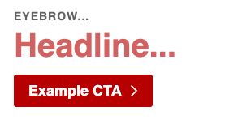

# CtaControl

A WordPress Gutenberg editor control component for editing link attributes for a block. For use in block editor templates, it displays a placeholder for the button or link, and when clicked, opens a popover for editing button text and link settings.




## Properties

| Property      | Type       | Required | Default  | Description |
|---------------|------------|----------|------------------------|
| `className`   | `string`   | No       |          | CSS class name for the control wrapper |
| `onChange`    | `function` | Yes      |          | Callback function when the CTA value changes |
| `value`       | `object`   | Yes      |          | Current CTA object containing title and link properties |
| `placeholder` | `string`   | No       | "CTA..." | Placeholder text to display when no CTA is set. Defaults to "CTA..." |

## Value Structure

The `value` prop should be an object with the following structure:

```javascript
{
	title: 'Button Text',
	link: {
		url: 'https://example.com',
		opensInNewTab: true,
	// ... other link properties from WordPress LinkControl
	}
}
```

## Control States

The interface adapts based on the current state:

- **No CTA set**: Shows placeholder text or "CTA..." with reduced opacity
- **CTA configured**: Shows button text with full opacity
- **Legacy data detected**: Shows "Rebuild CTA Value" button to migrate old data format

## Features

- **Button Text Editing**: TextControl for customizing the button text
- **Link Management**: WordPress LinkControl integration for URL and target settings
- **New Tab Option**: Toggle for opening links in new tabs
- **Delete Functionality**: Remove button to clear the CTA
- **Data Migration**: Automatic migration from legacy CTA data formats

## Related Components

- [WordPress LinkControl Component](https://github.com/WordPress/gutenberg/tree/trunk/packages/block-editor/src/components/link-control)
- [WordPress Popover Component](https://github.com/WordPress/gutenberg/tree/trunk/packages/components/src/popover)

## Usage

### Import

```jsx
import { CtaControl } from '../../editor-controls';
```

### Basic CTA Control

```jsx
<CtaControl
	className="block-button"
	value={ attributes.cta }
	onChange={ ( value ) => {
		setAttributes( { cta: value } );
	} }
	placeholder="My Custom Placeholder..."
/>
```
