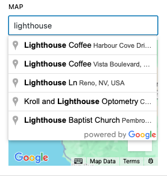

# GoogleMapControl

A WordPress Gutenberg editor control component for selecting locations using Google Maps. For use in block editor templates, it displays an interactive Google Map with an autocomplete search input, allowing users to search for addresses and select locations with precise coordinates.




## Props

| Prop | Type | Default | Description |
|------|------|---------|-------------|
| `mapsKey` | `string` | - | **Required.** Google Maps API key for authentication |
| `value` | `object` | - | **Required.** Current location value object |
| `onSelect` | `Function` | - | **Required.** Callback function when a location is selected |
| `label` | `string` | - | Label for the control |

## Value Structure

The `value` prop should be an object with the following structure:

```javascript
{
  address: "123 Main St, Santa Cruz, CA 95060, USA",
  lat: "36.9741",
  lng: "-122.0308"
}
```

## Control States

The interface adapts based on the current state:

- **No location selected**: Shows "Search for Address" placeholder text
- **Location selected**: Shows the selected address in the input field and displays a marker on the map
- **Loading**: Shows "Loading..." text while Google Maps API loads

## Features

- **Interactive Map**: Full Google Maps integration with zoom and pan controls
- **Address Autocomplete**: Google Places API integration for address search suggestions
- **Precise Coordinates**: Automatically captures latitude and longitude for selected locations
- **Visual Feedback**: Map marker indicates the currently selected location
- **Responsive Design**: Map container adapts to available space
- **Default Location**: Falls back to Santa Cruz, CA coordinates (35.278513, -120.664829) when no location is selected
- **Accessible**: Proper ARIA attributes and keyboard navigation support

## Dependencies

This component requires the following external libraries:

- `@react-google-maps/api` - Google Maps React integration
- `@wordpress/components` - WordPress Gutenberg components

## Google Maps API Setup

To use this component, you'll need:

1. A Google Maps API key with the following APIs enabled:
   - Maps JavaScript API
   - Places API
2. The API key should be passed as the `mapsKey` prop

## Related Components

- [Google Maps React API](https://github.com/JustFly1984/react-google-maps-api)
- [Google Maps JavaScript API](https://developers.google.com/maps/documentation/javascript)

## Usage

### Import
```jsx
import { GoogleMapControl } from '../../editor-controls';
```

### Basic Map Control

```jsx
<GoogleMapControl
    label="Event Location"
    mapsKey="your-google-maps-api-key"
    value={ attributes.location }
    onSelect={ ( location ) => {
        setAttributes( { location } );
    } }
/>
```

### Map Control with Custom Label

```jsx
<GoogleMapControl
    label="Store Address"
    mapsKey={ googleMapsApiKey }
    value={ attributes.storeLocation }
    onSelect={ ( location ) => {
        setAttributes( { storeLocation: location } );
    } }
/>
```
