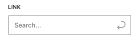
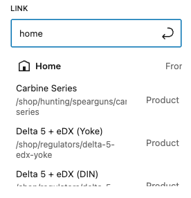

# LinkSelect

A WordPress Gutenberg editor control component for managing links with URL and target settings. This control wraps the WordPress LinkControl component in a BaseControl for consistent styling and behavior within the block editor sidebar.






## Props

| Prop | Type | Default | Description |
|------|------|---------|-------------|
| `label` | `string` | - | **Required.** Label text for the control |
| `value` | `object` | - | **Required.** Current link object containing URL and settings |
| `onChange` | `Function` | - | **Required.** Callback function when the link value changes |
| `onRemove` | `Function` | - | Callback function when the link is removed |

## Value Structure

The `value` prop should be an object with the following structure:

```javascript
{
  url: "https://example.com",
  opensInNewTab: true,
  // ... other link properties from WordPress LinkControl
}
```

## Features

- **URL Management**: Search and select existing pages/posts or enter custom URLs
- **New Tab Option**: Toggle for opening links in new tabs
- **Search Functionality**: Built-in search with placeholder "Search..."
- **Remove Functionality**: Option to remove/clear the link
- **Consistent Styling**: Uses BaseControl for consistent sidebar appearance
- **No Create Suggestions**: Disabled creation of new suggestions for cleaner UX

## Related Components

- [WordPress LinkControl Component](https://github.com/WordPress/gutenberg/tree/trunk/packages/block-editor/src/components/link-control)

## Usage

### Import
```jsx
import { LinkSelect } from '../../editor-controls';
```

### Basic Link Control

```jsx
<LinkSelect
    label="Select Link"
    value={ attributes.link }
    onChange={ ( value ) => {
        setAttributes( { link: value } );
    } }
    onRemove={ () => {
        setAttributes( { link: {} } );
    } }
/>
```
