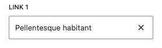

# PostPicker

A WordPress Gutenberg editor control component for selecting a single post via a searchable combobox. This control fetches posts from a specified post type and displays them in a searchable dropdown, allowing users to find and select a single post efficiently.




## Props

| Prop | Type | Default | Description |
|------|------|---------|-------------|
| `label` | `string` | - | **Required.** Label text for the control |
| `value` | `number` | - | **Required.** ID of the selected post |
| `onChange` | `Function` | - | **Required.** Callback function when the selection changes |
| `postType` | `string` | - | **Required.** WordPress post type to fetch posts from (e.g., 'post', 'page', 'product') |
| `orderBy` | `string` | `'id'` | Field to order posts by. Defaults to 'id' with descending order |

## Value Structure

The `value` prop should be a single post ID:

```javascript
123 // Single post ID
```

## Features

- **Single Selection**: Select one post using a searchable combobox
- **Dynamic Loading**: Automatically fetches posts from specified post type
- **Search Functionality**: Real-time search with debounced input (300ms delay)
- **Flexible Ordering**: Order posts by different fields (defaults to ID)
- **Efficient Queries**: Only fetches post ID and title for performance
- **Current Selection Display**: Shows currently selected post even when searching
- **Loading States**: Displays "Loading..." when posts are being fetched

## Usage

### Import
```jsx
import { PostPicker } from '../../editor-controls';
```

### Basic Post Selection

```jsx
<PostPicker
    label="Select Post"
    value={ attributes.selectedPost }
    onChange={ ( value ) => {
        setAttributes( { selectedPost: value } );
    } }
    postType="post"
/>
```

### With Custom Ordering

```jsx
<PostPicker
    label="Select Product"
    value={ attributes.selectedPost }
    onChange={ ( value ) => {
        setAttributes( { selectedPost: value } );
    } }
    postType="post"
    orderBy="title"
/>
```
