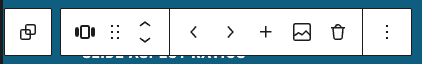

# RepeaterBlockControls

Renders a set of action buttons for adding, removing, moving, and managing repeater items directly in the block's toolbar.

Note: This control requires an active or current index to be defined, for example, a carousel with a current slide. If no active index is available, use the RepeaterControls component instead.



## Properties

| Property        | Type       | Required | Default | Description |
|-----------------|------------|----------|---------|-------------|
| `props`         | `object`   | Yes      |         | Block props containing `attributes` and `setAttributes` |
| `attribute`     | `string`   | Yes      |         | The attribute name for the repeater field |
| `itemLabel`     | `string`   | No       | `item`  | Text for repeater item, used in button labels |
| `index`         | `number`   | Yes      |         | The current row index |
| `newValues`     | any        | Yes      |         | Default values for new rows |
| `vertical`      | `boolean`  | No       | `false` | Whether to use vertical icons for the move buttons (up/down vs left/right) |
| `onImageChange` | `function` | No       | `false` | Callback when an image is selected |
| `imageValue`    | `number`   | No       | `false` | Current image ID if the `onImageChange` prop is set |
| `onAddAfter`    | `function` | No       | `false` | Callback when a row is added after the current one |
| `allowNull`     | `boolean`  | No       | `false` | Whether to allow deleting the last remaining row |
| `style`         | `object`   | No       |         | Custom styles for the controls container |

## Control Buttons

The component renders several action buttons based on the current context:

### Delete Button

- **Condition**: Shown when `allowNull` is true OR there's more than one row
- **Action**: Removes the current row from the repeater array
- **Icon**: Trash icon
- **CSS Class**: `capitola-repeater-controls__button --delete`

### Move Buttons

- **Move Before**: Moves current row up/left (shown when not first row)
- **Move After**: Moves current row down/right (shown when not last row)
- **Icons**: Directional arrows (up/down for vertical, left/right for horizontal)

### Add Buttons

- **Add After**: Inserts a new item after the current one

### Image Button

- **Condition**: Shown when `onImageChange` prop is provided
- **Action**: Opens WordPress media library for image selection

## Usage Examples

### Import

```jsx
import { RepeaterBlockControls } from '../../editor-controls';
```

### Basic Implementation

```jsx
<RepeaterBlockControls
	props={ props }
	itemLabel="slide"
	attribute="exampleItems"
	index={ currentIndex }
	newValues={ { title: '', desc: '' } }
/>
```

### With Image Support

```jsx
<RepeaterBlockControls
	props={ props }
	itemLabel="slide"
	attribute="gallery"
	index={ currentIndex }
	newValues={ { image: null, caption: '' } }
	onImageChange={ ( value ) => {
		const newItems = [ ...exampleItems ];
		newItems[ currentIndex ] = {
			...newItems[ currentIndex ],
			image: { id: value.id, source_url: value.url }
		};
		setAttributes( { exampleItems: newItems } );
	} }
	imageValue={ exampleItems[ currentIndex ].image?.id }
/>
```

### With Custom Callback

```jsx
<RepeaterBlockControls
	props={ props }
	attribute="items"
	index={ index }
	newValues={ { title: '', content: "" } }
	onAddAfter={ () => {
		// Custom logic after adding a row
		console.log('New row added after index:', index);
	} }
/>
```

## Related Components

- [WordPress ToolbarButton Component](https://github.com/WordPress/gutenberg/tree/trunk/packages/components/src/toolbar-button)
- [WordPress Icon Component](https://github.com/WordPress/gutenberg/tree/trunk/packages/components/src/icon)
- [WordPress MediaUpload Component](https://github.com/WordPress/gutenberg/tree/trunk/packages/block-editor/src/components/media-upload)

## Change Callback Examples

Saving array items can be tricky as memory leaks between blocks can occur if not done correctly. These are examples of updating attributes inside a map function.

### Simple Array

If the attribute is an array of single values:

```jsx
( value ) => {
	const newItems = [ ...exampleItems ];
	newItems[index] = value;
	setAttributes( { exampleItems: newItems } );
}
```

### Array of Objects

If the attribute is an array of objects, and you are saving a value inside an object, for example `'desc'` :

```jsx
( value ) => {
	const newItems = [ ...exampleItems ];
	newItems[ index ] = {
		...newItems[ index ],
		desc: value,
	};
	setAttributes( { exampleItems: newItems } );
}
```
