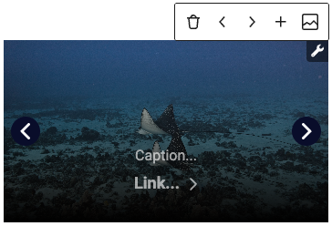

# RepeaterPopover

A WordPress Gutenberg editor control component that provides a popover interface for managing repeater field rows. Built on top of the WordPress `Popover` component with specialized functionality for adding, removing, moving, and managing repeater items.

<br>
With full button

<br>
With small button

<br>
Simple toolbar

<br>
With fields

## Properties

| Property        | Type        | Required | Default | Description |
|-----------------|-------------|----------|---------|-------------|
| `props`         | `object`    | Yes      |         | Block props containing `attributes` and `setAttributes` |
| `attribute`     | `string`    | Yes      |         | The attribute name for the repeater field |
| `index`         | `number`    | Yes      |         | The current row index |
| `newValues`     | any         | Yes      |         | Default values for new rows |
| `fullButton`    | `boolean`   | No       | `false` | Whether the trigger button should fill the entire parent container. This is the best option when all values will be set inside the popover instead of inline editing using RichText. |
| `vertical`      | `boolean`   | No       | `false` | Whether to use vertical icons for the move buttons (up/down vs left/right) |
| `onImageChange` | `function`  | No       | `false` | Callback when an image is selected |
| `imageValue`    | `number`    | No       | `false` | Current image ID if the onImageChange prop is set |
| `onAddAfter`    | `function`  | No       | `false` | Callback when a row is added after the current one |
| `allowNull`     | `boolean`   | No       | `false` | Whether to allow deleting the last remaining row |
| `style`         | `object`    | No       |         | Custom styles for the trigger button. Especially useful for size and positioning. |
| `children`      | `ReactNode` | No       | `null`  | Custom content to display in the popover |

## Toolbar Actions

The popover includes several built-in actions:

### Delete Button

- **Condition**: Shown when `allowNull` is true OR there's more than one row
- **Action**: Removes the current row from the repeater array
- **Icon**: Trash icon

### Move Buttons

- **Move Before**: Moves current row up/left (shown when not first row)
- **Move After**: Moves current row down/right (shown when not last row)
- **Icons**: Directional arrows (up/down for vertical, left/right for horizontal)

### Add Buttons

- **Add Before**: Inserts a new row before the current one
- **Add After**: Inserts a new row after the current one
- **Icons**: Plus icons with directional indicators

### Image Button

- **Condition**: Shown when `onImageChange` prop is provided
- **Action**: Opens WordPress media library for image selection
- **Icon**: Format image icon

## Related Components

- [WordPress Popover Component](https://github.com/WordPress/gutenberg/tree/5beedbfe7bfae026f9676ce2adde7702ff4413b8/packages/components/src/popover)
- [WordPress MediaUpload Component](https://github.com/WordPress/gutenberg/tree/trunk/packages/block-editor/src/components/media-upload)

## Usage

Place the component inside the looped template, as the last child. The elemnent it is placed in must have position relative, absolute, or any other non-static position.

### Import

```jsx
import { RepeaterPopover } from '../../editor-controls';
```

### Suggested Use

```jsx
{ attributes.exampleItems.map( (item, index ) => {
	return (
		<div key={ index } className="item">
			<RichText
				className="item-title"
				value={ attributes.exampleItems[index].title }
				placeholder="Title..."
				allowedFormats={ [] }
				onChange={ ( value ) => {
					const newItems = [ ...exampleItems ];
					newItems[ index ] = {
						...newItems[ index ],
						title: value,
					};
					setAttributes( {
						exampleItems: newItems,
					} );
				} }
			/>
			<RichText
				className="item-desc"
				value={ attributes.exampleItems[index].desc }
				label="Description"
				allowedFormats={ [] }
				onChange={ ( value ) => {
					const newItems = [ ...exampleItems ];
					newItems[ index ] = {
						...newItems[ index ],
						desc: value,
					};
					setAttributes( {
						exampleItems: newItems,
					} );
				} }
			/>
			<RepeaterPopover
				props={ props }
				attribute="exampleItems"
				index={ index }
				fullButton={ true }
				newValues={ { title: '', desc: '' } }
			>
			</RepeaterPopover>
		</div>
	)
} ) }
```

### fullButton Suggested Use

```jsx
{ attributes.exampleItems.map( (item, index ) => {
	return (
		<div key={ index } className="item">
			<div className="item-title">{item.title}</div>
			<div className="item-desc">{item.desc}</div>
			<RepeaterPopover
				props={ props }
				attribute="exampleItems"
				index={ index }
				fullButton={ true }
				newValues={ { title: '', desc: '' } }
			>
				<TextControl
					value={ attributes.exampleItems[index].title }
					label="Title"
					onChange={ ( value ) => {
						const newItems = [ ...exampleItems ];
						newItems[ index ] = {
							...newItems[ index ],
							title: value,
						};
						setAttributes( {
							exampleItems: newItems,
						} );
					} }
				/>
				<TextControl
					value={ attributes.exampleItems[index].desc }
					label="Description"
					onChange={ ( value ) => {
						const newItems = [ ...exampleItems ];
						newItems[ index ] = {
							...newItems[ index ],
							desc: value,
						};
						setAttributes( {
							exampleItems: newItems,
						} );
					} }
				/>
			</RepeaterPopover>
		</div>
	)
} ) }
```


### With Image Support

```jsx
<RepeaterPopover
	props={ props }
	attribute="gallery"
	index={ index }
	newValues={ { image: null, caption: '' } }
	onImageChange={ ( value ) => {
		const newItems = [ ...exampleItems[index] ];
		newItems[index].image = { id: value.id, source_url: value.url };
		setAttributes( { exampleItems: newItems } );
	} }
	imageValue={ exampleItems[index].image.id }
/>
```

## Change Callback Examples

Saving array items can be tricky as memory leak between blocks can occur if not done correctly. These are examples of updating attributes inside a map function.

### Simple Array

If the attribute is an array of single values:

```jsx
( value ) => {
	const newItems = [ ...exampleItems[index] ];
	newItems[index] = value;
	setAttributes( { exampleItems: newItems } );
}
```

### Array of Objects

If the attribute is an array of objects, and you are saving a value inside an object, for example 'desc' :

```jsx
( value ) => {
	const newItems = [ ...exampleItems[index] ];
	newItems[ index ] = {
		...newItems[ index ],
		desc: value,
	};
	setAttributes( { exampleItems: newItems } );
}
```
